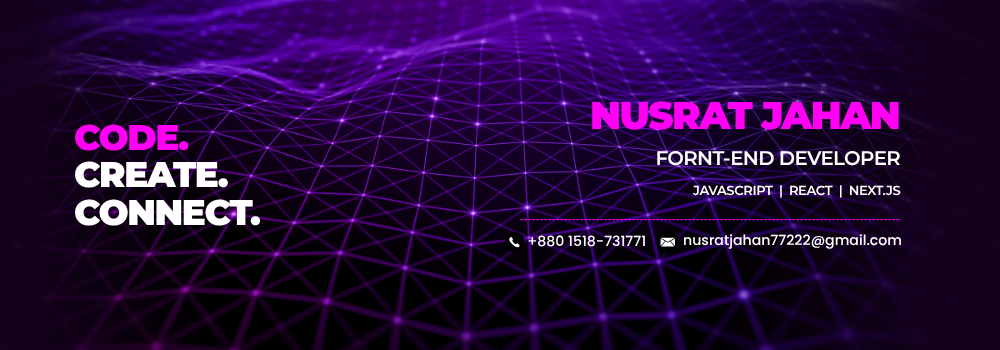
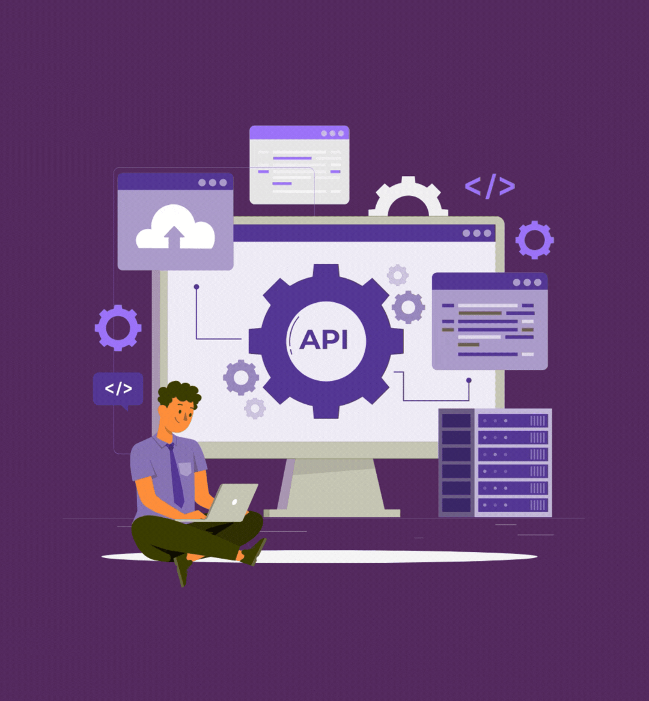
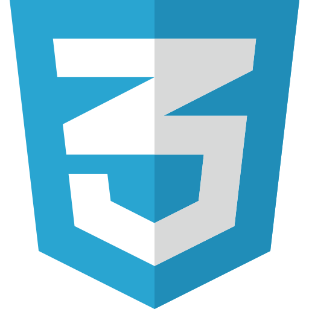

<div align="center">
        
    <h1 align="center">
  <a href="https://git.io/typing-svg"></a>
</h1>

</div>

<div align="center">
  <strong>Front-End Web Developer 👋 | Expert in JavaScript, React.js, Next.js | 🚀 Passionate about building modern, user-friendly web applications  🌍 | ⚡ Love creating clean UI and smooth user experiences </strong>
</div>
<br/>

<p align="center" style="display: flex; gap: 25px; justify-content: center;">

  <a href="https://facebook.com/nuraisanus" style="margin-right: 8px;">
    
  </a>

  <a href="https://instagram.com/nuraisa_nusrat" style="margin-right: 8px;">
    
  </a>

  <a href="https://linkedin.com/in/nusratjahan77" style="margin-right: 8px;">
    
  </a>

  <a href="mailto:nusratjahan77222@gamil.com" style="margin-right: 8px;">
    
  </a>

  <a href="https://discord.gg/nusratjahan772" target="_blank" style="margin-right: 8px;">
    
  </a>

  <a href="https://wa.me/+8801518731771" target="_blank">
    
  </a>

</p>

<hr/>


<br />

### Talking about Personal Stuff:

- 🛠 &nbsp; I’m currently working with <strong>JS, React, React Router</strong>
- 🚀 &nbsp; I’m currently exploring <strong>Next.js, Debugging and problem-solving technique</strong>
- 📫 &nbsp; Reach me out: <strong>nusratjahan77222@gmail.com </strong>

### My Absolute Favorites:

- 💻 &nbsp; I love exploring new technologies and building cool stuff.
- 💕 &nbsp; Creating Modern UI designs and turning them into real, working websites.

<hr/>

<h2 align="center">🔥 Languages & Frameworks & Tools 🔥</h2>

<p align="center">





 


</p>

```javascript
const nusratJahan = {
  pronouns: "she/her",
  code: ["HTML", "CSS", "JavaScript"],
  tools: ["React", "Tailwind CSS", "Git", "GitHub", "Vercel", "Netlify"],
  learning: ["Next.js"],
  currentFocus: [
    "Building scalable and responsive web applications",
    "Strengthening core JavaScript and React fundamentals",
    "Improving problem-solving and debugging skills",
  ],
  goals: "Become a full-stack developer",
  challenge: "Consistently improving skills by building and shipping projects",
};
```

## 📊 &nbsp;Github Stats

[](https://github.com/ashutosh00710/github-readme-activity-graph)
